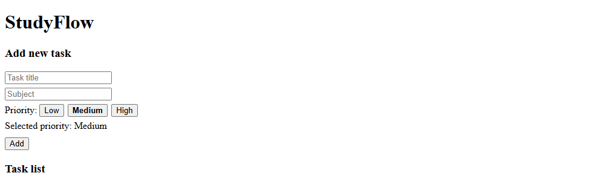

# StudyFlow

StudyFlow is an F# web application for tracking university subjects, assignments, deadlines and priorities.

## Motivation

As a university student, it is easy to lose track of assignments and deadlines across multiple courses. The goal of this project is to create a simple and practical study task tracker with a clean interface and useful filtering options.

## Planned features

- Add subjects
- Add study tasks
- Set deadlines
- Set priorities
- Mark tasks as completed
- Filter tasks by subject and status
- Show simple statistics

## Technologies

- F#
- .NET
- WebSharper / SPA approach

## Build and run

```bash
dotnet build
dotnet run

## Screenshot

